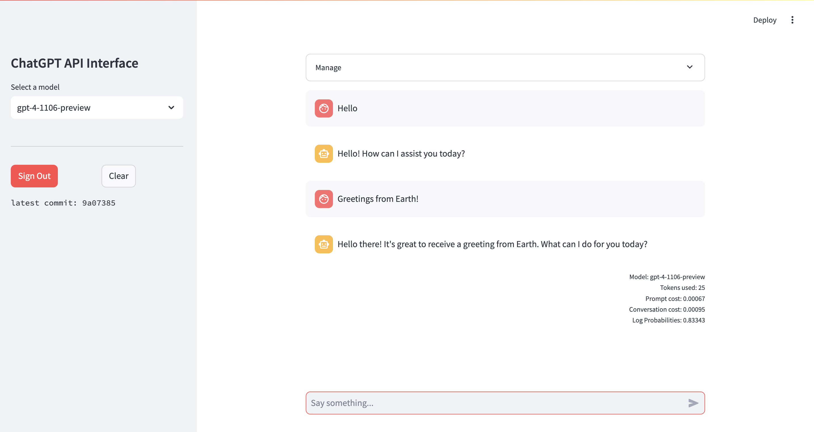

# About
Playing with OpenAI's ChatGPT API.
- Requires: `Python>=3.10`
- Install Python packages: `pip install -r requirements.txt`
- Run app: `streamlit run app.py`
- OpenAI API Key in a .env file: `OPENAI_API_KEY=XXX`

# Features
- Uses LangChain to standardise implementation
- Choose between Anthropic's Claude and OpenAI's ChatGPT models
- Determines token usage
- Calculates the costs of prompts
- Implements `seed` for deterministic prompts
- Estimates the confidence of a response on a 0-1 scale
- Implements a Firebase backend for user authentication & management

