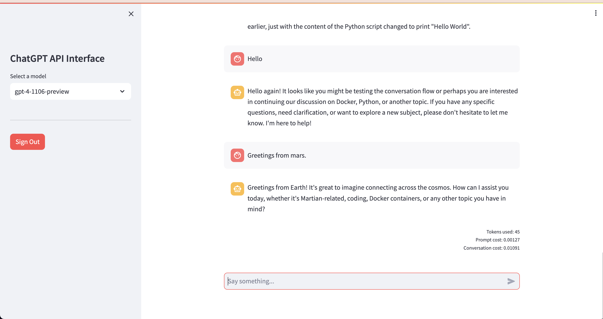

# About
Playing with OpenAI's ChatGPT API.
- Requires: `Python 3.10`
- Install Python packages: `$pip install -r requirements.txt`
- Run app: `$streamlit run app.py`
- OpenAI API Key in a .env file: `OPENAI_API_KEY=XXX`

# Screenshot
